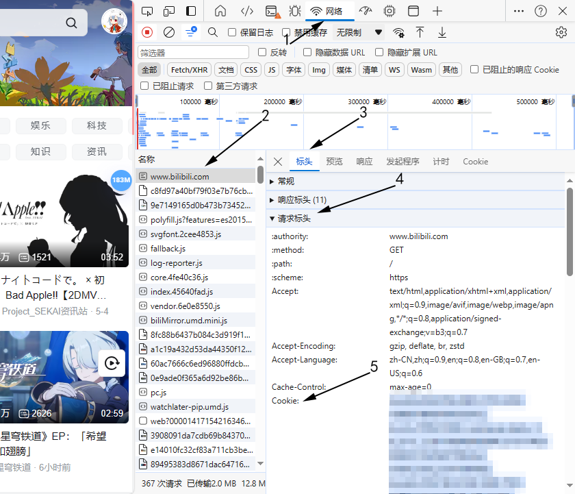

#Bilibili Download 

----------

#一些提示

由于暂未加入免登录API所以下载480P以上的视频需要登陆信息的Cookie
分辨率从`HDR`开始，仅支持`HEVC`格式，尽管脚本提示支持其它格式
`BV15z4y1Z734`这个视频的标题中这个符号“｜”和这个符号“|”不一样，前者肉眼看上去多宽一点，后者在系统里面会报错
此文本带“*”表示为从互联网收集，没有经过测试
此脚本只在windows 10下测试过
**请将Cookie信息保存为txt文件**[获取cookie信息][def4]

----------

#开始

此脚本可以下载bilibili视频与动漫
此脚本可以自动解析动漫还是视频，所以直接把链接粘贴即可

以下是例子

    py __main__.py https://www.bilibili.com/video/BV15W4y187Gy?p=93
这样下载全部集

    py __main__.py https://www.bilibili.com/video/BV15W4y187Gy?p=93 --playlist
或

    py __main__.py https://www.bilibili.com/video/BV15W4y187Gy?p=93 -p

下载指定集数的视频可以在BV号面加“?p=集数”，当指定 -p 或 --playlist 时，此选项无效

下载指定动漫时，需要复制指定集的链接（右键右侧选集菜单的指定集数>复制链接(PC浏览器方法)），指定 -p 或 --playlist 时，此选项无效

----------

#主要参数

    __main__.py URL 参数

  参数：

 - -h 获取帮助 
 - -cod 设置编码格式 （建议不选留空）
 - -qua 设置分辨率 
    上面两个参数可参考[编码与分辨率][def2]
 - -c 加载Cookie 
 - -a 设置[音效][def3]
 - -o 设置输出文件夹
 - -f 指定“FFmpeg.exe”所在的环境(文件夹)，默认为运行目录+“_FFmpeg”，指定目录即可不用指定到应用程序

----------

#必要软件与库

- 安装 colorama 

```
pip install colorama
```
- FFmpeg 

  - 下载[FFmpeg][def5]

  - 解压压缩包
  - 把`Bin`文件夹里面的程序全部解压到`脚本运行目录/_FFpmeg`下
- Python（测试使用的为3.12）

----------


#运行过程

##下载视频

    >py __main__.py https://www.bilibili.com/video/BV1wC41137NL -c ./cookie.txt
    [14:36:25][Info]合集名:
    [14:36:25][Info]视频名:不是，兄弟 【表情包大赏】
    [14:36:25][Info]当前集数支持的编码：[12, 7, 13]
    [14:36:25][Info]当前集数支持的分辨率：['80(1080P)', '64(720P(MP4))', '32(480P)', '16(360P)']
    [14:36:25][Info]当前选中的分辨率:80
    [14:36:25][Info]当前选中的编码格式:7
    [14:36:25][Tip]当前选中普通音效
    [14:36:25][Info]下载视频
    进度: 100%  --------------------------------------------------
    
    [14:36:31][Info]下载音频
    进度: 100%  --------------------------------------------------
    
    [14:36:37][Info]合并
    [14:36:37][Tip]./saved/不是，兄弟 【表情包大赏】.mp4 已经下载

##下载动漫

    >py __main__.py https://www.bilibili.com/bangumi/play/ep98603 -c ./cookie.txt
    [15:43:11][Tip]这个Bangumi有 14 个视频 使用 -p 下载播放列表
    [15:43:11][Info]第1集
    [15:43:11][Info]合集名:小林家的龙女仆
    [15:43:11][Info]视频名:《小林家的龙女仆》第1话 史上最强女仆、托尔！(毕竟是龙嘛)
    [15:43:11][Info]当前集数支持的编码：[12, 7, 13]
    [15:43:11][Info]当前集数支持的分辨率：['80(1080P)', '64(720P(MP4))', '32(480P)', '16(360P)']
    [15:43:11][Info]当前选中的分辨率:80
    [15:43:11][Info]当前选中的编码格式:7
    [15:43:11][Tip]当前选中普通音效
    [15:43:11][Info]下载视频
    进度: 100%  --------------------------------------------------
    
    [15:44:02][Info]下载音频
    进度: 100%  --------------------------------------------------
    
    [15:44:12][Info]合并
    [15:44:14][Tip]./saved/《小林家的龙女仆》第1话 史上最强女仆、托尔！(毕竟是龙嘛).mp4 已经下载

----------

#获取Cookie信息

##Edge浏览器

在B站首页>按F12打开开发者工具>切换到网络选项卡>按F5刷新>点击www.bilibili.com的请求>选择标头>请求标头>Cookie



----------

#编码与分辨率

##分辨率
|ID|分辨率|
|-
|16|360P|
|32|480P|
|48|720P|
|64|720P(MP4)|
|74|720P60帧|
|80|1080P|
|112|1080P+(高码率)|
|116|1080P 60帧|
|120|4K|
|125|HDR|
|126|杜比视界|
|127|8K|

##编码格式*

|ID|格式
|-
|7|AV1|
|12|HEVC|
|13|AVC|


----------

#音效

|ID|音效|
|-
|h|Hi-Res|
|d|杜比音效(下载杜比视界的视频时，建议指定此音效)|
|n|普通音效|
注：不指定音效即为自动选择

----------

#其它

##作者留言:

    有些视频在名称里面会加转义字符
    比如 www.bilibili.com/bangumi/play/ss6400,这个bangumi在json里面是这样写标题的:“第一折\t危险！迷之荒野” 
    www.bilibili.com/bangumi/play/ss2629/,这个bangumi的OVA标题还特喵的带“/”
    系统命名不能带这类的符号
    B站程序员扣工资(ˉ▽ˉ；)...

##Bug反馈或给予建议

    E-maill:rengcheng_luo@outlook.com


[def]: ./Cookie.png,"获取Cookie"
[def2]: #编码与分辨率
[def3]: #音效
[def4]: #获取cookie信息
[def5]: https://github.com/BtbN/FFmpeg-Builds/releases/download/latest/ffmpeg-master-latest-win64-gpl-shared.zip
